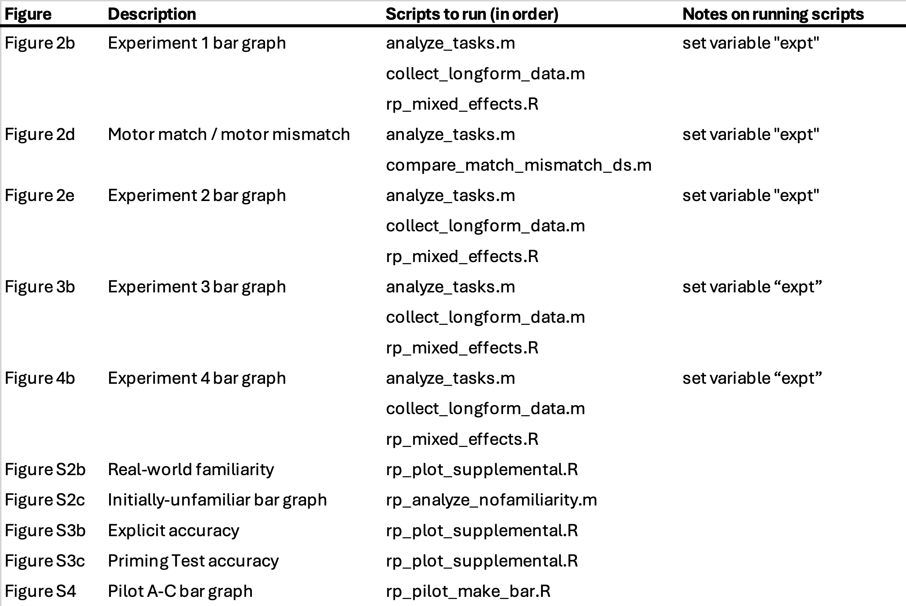

# README
### 1. System requirements
MATLAB 2024a
R Statistical software 

### 2. Installation guide
To install MATLAB, visit [MathWorks Account Sign In](https://www.mathworks.com/downloads/)
MATLAB takes roughly 10-15 minutes to install on a "normal" laptop computer. 

To install R, visit [R Project](www.r-project.org)

### 3. Demo
Go to mem-based-predictions/analysis-scripts to run the code. 

#### Primary Scripts: 
**analyze_tasks.m** calculates the median reaction times for each condition in a given experiment (Experiments 1-4) and produces a bar plot and computes pairwise t-tests for each pair of bars. 

To run, open the script in MATLAB, then indicate an Experiment to analyze (Experiments 1-4) by setting the "expt" variable at the top of the script. Then, press "run". 

**collect_longform_data.m** collects participant data in long format to be used in linear mixed effects models.

**rp_mixed_effects.R** runs linear mixed effects models on long-form data for Experiments 1-4. 

For a full list of scripts corresponding to manuscript figures (as of Jan 10 2024), please refer to this chart: 

# mem-based-predictions
